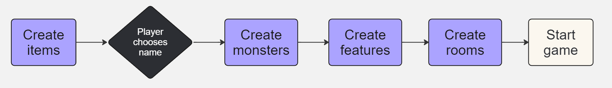
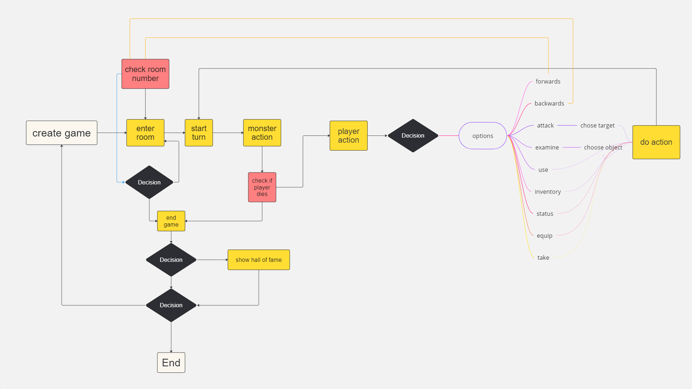
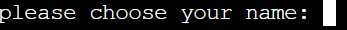
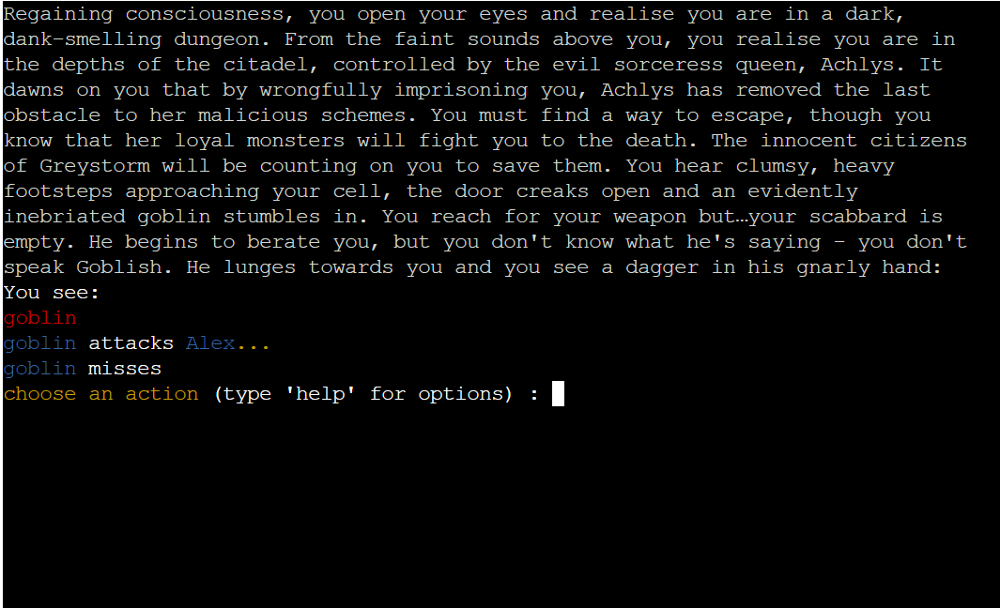
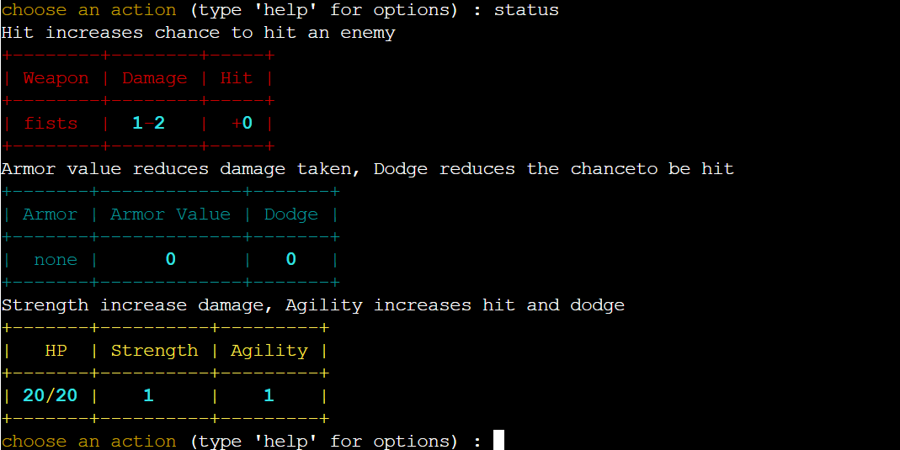
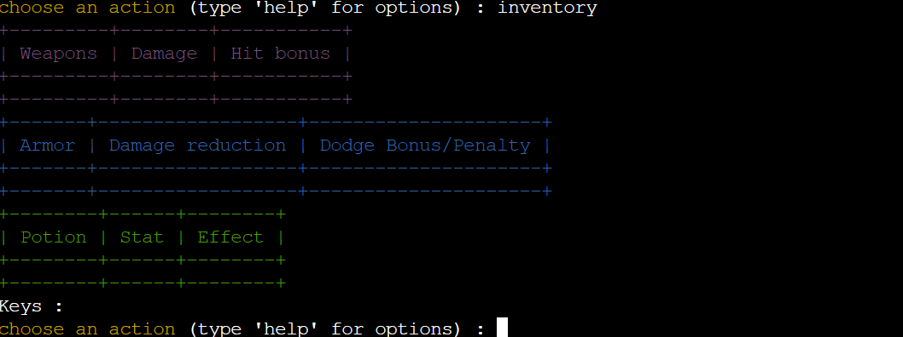
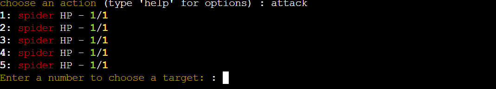
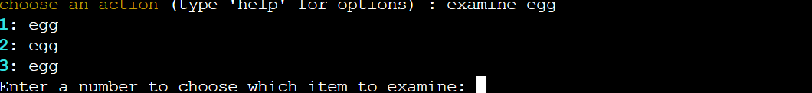
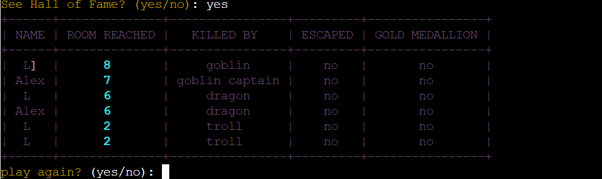
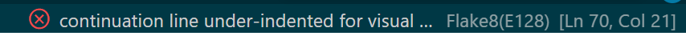

[Monstoryum](https://monstoryum-24200bf7a5d2.herokuapp.com/) is a classic text RPG adventure game.
It is programmed in python to be played in the terminal.
The player begins in a room, locked in a jail cell, and must complete challenges in each room, defeating monsters in or to escape the dungeon. It has been deployed in a mock terminal.

Monstoryum was made as a project to showcase the Python skills of the website developer.

## Table of Contents
1. <details open>
    <summary><a href="#ux">UX</a></summary>

    <ul>
    <li><details>
    <summary><a href="#goals">Goals</a></summary>

    - [Visitor Goals](#visitor-goals)
    - [Business Goals](#business-goals)
    - [User Stories](#user-stories)
    </details></li>
</details>

2.  <details open>
    <summary><a href="#features">Features</a></summary>

    - [Intro screen](#intro-screen)
    - [Examine room screen](#examine-room-screen)
    - [Inventory](#inventory)
    - [Status](#status)
    - [Target select](#target-select)
    - [Examine select](#exmamine-select)
    - [Hall of fame](#hall-of-fame)

</details>

3. <details open>
    <summary><a href="#technologies-used">Technologies Used</a></summary>

    - [Languages](#languages)
    - [Libraries](#libraries)
</details>

4. <details open>
    <summary><a href="#testing">Testing</a></summary>

    <ul>
    <li><a href="#validation">Validation</a></li>
    <li><a href="#manual-testing">Manual Testing</a></li>
    <li><details>
    <summary><a href="#bugs">Bugs</a></summary>

    - [Unfixed Bugs](#unfixed-bugs)
    - [Fixed Bugs](#fixed-bugs)
    </details></li>
    </li>
    </ul>
</details>

5. <a href="#future-improvements">Future Improvements</a>

6. <details>
    <summary><a href="#deployment">Deployment</a></summary>

    - [Local Deploymen](#local-deployment)
    - [Deploy to Heroku](#deploying-to-heroku)
    
</details>

7. <a href="#credits">Credits</a></summary>


----

# UX
## Goals
### Visitor Goals
The target audience for MonStoryum:
- The game is aimed at all fans of classic RPG games

User goals are:
- Have fun
- Be immersed in the story
- complete challenges, learn stategies to beat the game
- replay the game after playing all the way through

MonStoryum fills these needs by:
- Providing a challenging game
- Provind detailed descriptions of all rooms, monsters and items
- Providing a variety of challenges for the player to complete in each room
- Providing an extra optional challenge for the player before completing the game

### Business Goals
The Business Goals of MonStoryum are:
- Provide a fun game to engage visitors to the website
- Showcase the skills of the website owner

### User Stories
1. As a user, I expect to the game commands to be clear
2. I expect feedback on any input I enter
3. I expect to be able to check the status and inventory of my player
3. I expect to compare my results with other players at the end of the game

## Development
### Logical Flow
<div align="center">
  
</div>

<div align="center">
  
</div>


### Process

 - The concept for the game was to have a linear set of rooms, with the option to only go forwards or backwards, in order to keep the scope manageable.
- I initially created the classes that I would need to create the game content.

- Since item objects are also attributes of other classes, I had to make the item class first.

- Monsters and features are attributes of the room class, so needed to be created next.

- Once these classes had been created, then the rooms could be created and populuated.

- The Player and Dragon classes were added as extensions of the Monster class. The Player class adds methods relating to the inventory and status actions. The Dragon class adds a talk method, which calls the hangman game.

- The hangman game was made as an independent game, for testing purposes and then imported to the main game. 

- Due to the size of the program, the code was refactored into modules:
    1. [run.py](run.py) calls the create game and enter room functions to start the game
    2. [create_game.py](game/create_game.py) imports all of the classes and creates object instances that are needed for the game, it monsters, items, features, rooms. As the Player class is an extension of the Monster class, it is also created here, and the player is prompted to enter a name
    3. [play_turn.py](game/play_turn.py) contains all of the functions that run once the game has started, with the exception of the endgame functions and clear_console function
    4. [endgame.py](game/endgame.py) contains the functions that end the game, and updates the google sheet containing the Hall of Fame data
    5. [clear.py](game/clear.py) contains a function to clear the console
    6. [hangman.py](game/hangman.py) contains the hangman mini-game within the game
    7. The other modules ([item.py](game/items.py), [monster.py](game/monster.py), [feature.py](game/feature.py), [room.py](game/room.py)) contain the classes used for the game

# Features

## intro screen

<div align="center">
  
</div>

The start screen prompt the player to choose a name before starting the game

## examine room screen

<div align="center">
  
</div>

- The examine room screen appears at the begnning of the game, when a player enters a room, or when the player types examine room
- It contains a description of the room, along with all of the items, features and monsters in the room
- When the room has been visited, a shorter description appears

## Status

<div align="center">
  
</div>

- The status tables show important information about the player

- Which weapon the player has equipped

- Which armor the player has equipped

- The current and maximum HP of the player

## Inventory

<div align="center">
  
</div>

- The Inventory table shows which items the player is carrying, along with important information about the item

- The items are grouped by category
    * Weapons
    * Armor
    * Potions
    * Keys

## Target Select

<div align="center">
  
</div>

- Target select allows players to choose a target by entering a number from a list

- Target select is show when
    * The player does not specify a target
    * There is more than one instance of the same monster

## Exmamine Select

<div align="center">
  
</div>

- Examine select allows players to choose an item/monster/feature by entering a number from a list

- Examine select is shown when there is more than one instance of the item/monster/feature

## Hall of Fame

<div align="center">
  
</div>

 - The Hall of Fame is shown at the end of the game, either when the player dies, or wins the game

 - The player results are stored in google sheets using the gsrpead API

 - The table shows which room the player reached, which monster they were killed by, if the escaped (won the game)

 - The gold medallion can bet obtained by killing the dragon before leaving the dungeon and is an extra challenge for those who have already beaten the game

# Technologies Used
## Languages
- [Python](https://www.python.org/)

## Libraries
### Python modules
 #### Built in
- [random](https://docs.python.org/3/library/random.html)
    * randomising initial game variables
    * randomising attack hits and damage
- [math](https://docs.python.org/3/library/math.html)
    * rounding up randomly generated numbers to whole numbers
- [time](https://docs.python.org/3/library/time.html)
    * delay betweet attacks
    * delaying console clear to allow time to read messages
- [os](https://docs.python.org/3/library/os.html)
    * clear the console on all operating systems
- [operator](https://docs.python.org/3/library/operator.html)
    * sort the Hall of Fame by column
    
#### Others
- [rich](https://rich.readthedocs.io/en/stable/introduction.html)
    * colored text output
    * identify objects the player can interact with
    * highlight important information
- [prettytable](https://pypi.org/project/prettytable/)
    * print out informations in tables
    * Inventory, status, Hall of Fame
- [gspread](https://docs.gspread.org/en/latest/py-modindex.html)
    * required for the [gspread API](https://docs.gspread.org/en/v6.0.0/)

## API's

- [Gspread](https://docs.gspread.org/en/v6.0.0/)
    * Store player results in the Hall of Fame

## Platforms
- [Github](https://github.com/)
    * Storing code remotely
- [Gitpod](https://gitpod.io/)
    * IDE for project development
- [Heroku](https://heroku.com/)
    * Deployment
- [Google Sheets](https://docs.google.com/spreadsheets/u/0/)
    * Storing the Hall of Fame data
- [Google Cloud](https://cloud.google.com/)
    * Managing the gspread API

# Testing
## Validation

- [Pylint](https://pypi.org/project/pylint/) and [Flake8](https://flake8.pycqa.org/en/latest/) were used for validation

- [autopep8](https://pypi.org/project/autopep8/) was used to automatically format the code

- most of the remaining errors were lines that were too long, which had to be changed manually

- The following warning from Pylint remain

    * Rich redefines the print function, which was used for color in the game

    * The formatting warnings relate to the argument of a table in prettytable, using and f string caused the data to display incorrectly, therefore I did not change it to an f string

    * The unused arguments were needed for Monster methods which were redefined for subclassses, so that I could call the method with all Monster objects without an error

- One error from Flake8 remained regardless of the indentation I used


<div align="center">
  
</div>


<div align="center">
  
</div>

## Manual testing

- Inputs were tested at each stage of developent, they would be too lengthy to put into a table

- The program was tested with repeated runthroughs after completion

## Bugs

### Unfixed Bugs

There are no unfixed bugs that I am aware of.

### Fixed Bugs

The endgame functions originally called the main function to restart the game and break out of the start_turn loop. 

However after refactoring the code to modules, these caused an import recursion error. Therefore I refactored to code to exit the loop when the game had finished. This caused several bugs, where the game would continue the loop when it ended, or text was printed that should not appear on the screen. I had to fix these by introducing extra variables and condition checks to exit the loop when the game ended.

I also refactored recursive function calls to while loops.

Because the Enter_room function calls the start_turn function, which in turn calls the enter_room function when the player chooses to enter a new room, there is still a recursion loop in the code. This could be refactored by putting the enter_room function in while loop, and returning the room number from the start_turn function instead of calling the enter_room function again. However due to time constraints I fixed this in an unelegant way by recursively exiting the function at the end_game. 


# Future Improvements

- add a room map, that updtes when the player explores

- add a seconds room index, so that the player has a choice of directions and the game is not linear

- add friendly monster mechanics

# Deployment

Note: in order to deploy the game, you will need a copy of the creds.json file, which is not included in the github repository for security reasons.

## local deployment

### Clone the Repository

1. Open a terminal in the folder you want to clone the project to.

2. In the terminal type:

    ```
      git clone https://github.com/alexrobincrabbe/Monstoryum
    ```

3. Change to the repository folder:

    ```
      cd .\Boopball\
    ```
4. Install requirements:

    ```
      pip install -r requirements.txt

    ```
5. Run the game:

    ```
      pip install -r requirements.txt

    ```

## Deploying to Heroku

### Make a repository on Github

1. Open a terminal in the folder you want to clone the project to.
2. In the terminal type:

    ```
      git clone https://github.com/alexrobincrabbe/Boopball
    ```

3. Change to the repository folder:

    ```
      cd .\Boopball\
    ```

6. Remove the origin:

    ```
      git remote rm origin"
    ```

5. On Github, create a new repository with a name of your choosing.

6. Add your Github repository to the origin:

    ```
      git remote add origin <url of your repository>
    ```

7. Push the files to your repository:

    ```
      git push --set-upstream origin main
    ```
### Heroku

1. You will need a Heroku account and to log into it

2. Click on New --> Create new app

3. Choose an app name, and your region --> click create app

4. Click on the setting tab

5. Add buildpack Python

6. Add buildpack NodeJs

7. Click on Reveal Config Vars

8. Enter key "PORT"  and value "8000"

9. Enter key "CREDS" and value will be the content of the creds.json file

10. Click on the deploy tab

11. Click on connect to github

12. Enter the path to your github repository

13. Click on deploy branch

# Credits

Thanks to Leda for helping with the room descriptions
